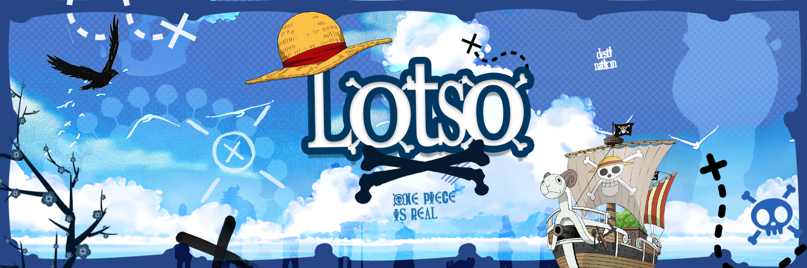

# Salut 👋, je suis Lotso :
🔭 Je travaille actuellement sur : Développement de serveurs FiveM actuellement sur Darkside RP avec intégration de scripts et interfaces personnalisées en HTML/CSS. 👯 Je cherche à collaborer sur : Des projets FiveM, création de ressources et de designs pour des serveurs RP ou autres. 🤠Je cherche de l'aide pour : Optimiser les performances des scripts et intégrer de meilleures interfaces utilisateur en HTML/CSS. 🌱 Je suis en train d'apprendre : Améliorer mes compétences en JavaScript pour enrichir l'interactivité dans les interfaces FiveM. 💬 Demande-moi à propos de : La création de ressources sur FiveM, l'optimisation des interfaces utilisateur, et l'intégration HTML/CSS. ⚡ Fun fact : Saviez-vous que FiveM permet aux développeurs de modifier quasiment tous les aspects de GTA V, du gameplay à l'interface utilisateur ? 

## 🌐 Socials:
 

# 💻 Tech Stack:
        
# 📊 GitHub Stats:
 
 

### ✍️ Random Dev Quote

<!-- Proudly created with GPRM ( https://gprm.itsvg.in ) -->
